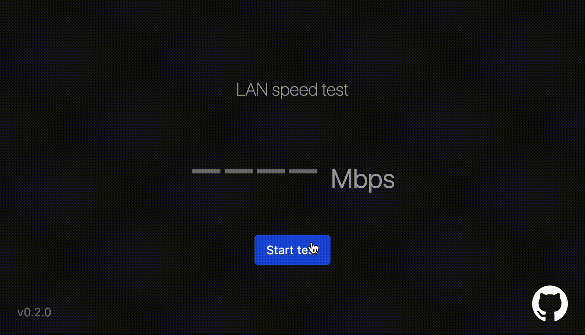

# LANSpeedTest

Measures data transfer speed for your LAN.  Install the server on one machine and connect to it from another machine on your network.



## Notes for Proxmox

Choose the following settings:

- 2GB disk size
- 1 core
- 512MB RAM

## Installation (Only Ubuntu supported at the moment)

Install curl if needed

```bash
sudo apt update
sudo apt upgrade
sudo apt install curl
```

```bash
sh <(curl -s https://raw.githubusercontent.com/umamimolecule/speedtest/main/install/install.sh)
```
